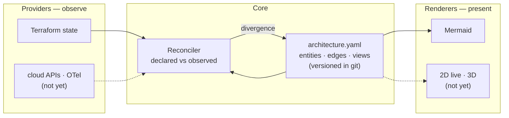
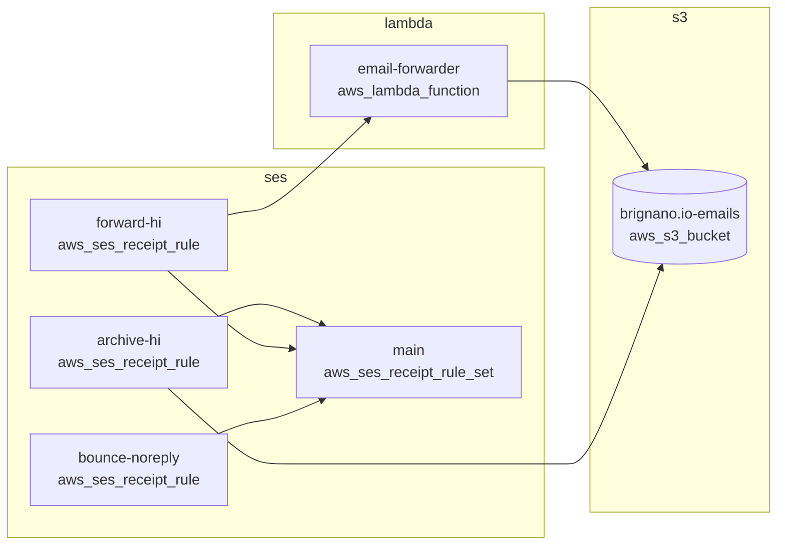

# driftwood

**Architecture as code, reconciled with live infrastructure.**

A versioned architecture *model* in git that is continuously checked against reality — Terraform state today, cloud APIs and telemetry later. When the model and the infrastructure diverge, that divergence becomes a pull request instead of a diagram nobody trusts.

> Status: **proof of concept.** The core loop works end to end. See [Where this is going](#where-this-is-going) for what is deliberately not built yet.

## Why

Two problems that are usually treated separately share one root cause:

- **Diagrams-as-code tools** (Structurizr, C4, `mingrammer/diagrams`, D2) move the picture into git but don't stop it rotting. A hand-maintained model decays exactly like a Visio file, just with better blame.
- **Live topology tools** (Dynatrace Smartscape, Datadog Service Map, Kiali) show real discovered topology but produce no artifact — nothing to version, nothing to review, no expression of design *intent*, and nothing a coding agent can edit.

Nobody owns the middle. driftwood is the middle.

### Graphviz: bundled, not required

`mingrammer/diagrams` requires the Graphviz **system binary**, which is often impossible to get approved inside a corporate environment. driftwood ships Graphviz instead of requiring it.

`@hpcc-js/wasm-graphviz` is real Graphviz compiled to WebAssembly — same DOT semantics, same layouts, zero transitive dependencies, WASM inlined into the JS. It is a **regular dependency**, so a plain `npm install` gives you working Graphviz on any machine, with no system package and no admin rights.

| Engine | Needs | Output |
|---|---|---|
| `graphviz` (native) | `dot` on PATH | SVG. Preferred when present — faster on very large graphs, honours a site's own Graphviz build |
| `graphviz` (WASM) | **nothing — bundled** | SVG. The default |
| `dot` | nothing | DOT source (it's just text) |
| `mermaid` | nothing | Mermaid, renders natively in GitHub |

Out of the box:

```
$ driftwood engines
graphviz   available    bundled @hpcc-js/wasm-graphviz
mermaid    available    built-in
dot        available    built-in

auto would use: graphviz (bundled @hpcc-js/wasm-graphviz)
```

The one environment where Graphviz still can't run is a runtime with WebAssembly switched off — a hardened container, or `node --jitless`. There `auto` degrades to Mermaid rather than failing:

```
$ node --jitless dist/cli.js engines
graphviz   unavailable  WebAssembly is disabled in this runtime, so the bundled Graphviz cannot load - install the `dot` binary or use --engine mermaid
...
auto would use: mermaid (built-in)
```

Rare, but real — which is why the fallback isn't vestigial. Both paths are asserted in CI.

For size context, the bundled Graphviz is **smaller than `zod`**, which driftwood already depends on:

| Package | Size | Transitive deps |
|---|---|---|
| `zod` | 5.2 MB | — |
| `@hpcc-js/wasm-graphviz` | 2.1 MB (804 KB runtime) | none |
| `yaml` | 1.4 MB | — |

## How it fits together



The model is the only thing in git. Providers write into it, renderers read from it, the reconciler diffs it. Because everything routes through one model, "static diagram vs. live health" and "2D vs. 3D" are rendering modes rather than rewrites — health is just an attribute on a node, and blast radius is a traversal over edges that already exist.

## Install

```bash
npm install
npm run build
```

Requires Node 20+. Runtime dependencies are `commander`, `yaml`, `zod`, and `@hpcc-js/wasm-graphviz` — all pure JavaScript/WebAssembly, no native builds and no system packages.

## Usage

### Import a model from Terraform state

```bash
npx tsx src/cli.ts import terraform examples/aws-config.tfstate.json \
  --name aws-config -o examples/architecture.yaml
```

Entity ids are Terraform addresses (`aws_s3_bucket.emails`). That's deliberate: the address is stable across plans, readable in a diff, and sidesteps the identity-resolution problem that kills CMDBs. Edges come from Terraform's own `dependencies`.

### Validate

```bash
npx tsx src/cli.ts validate examples/architecture.yaml
```

Catches schema errors, duplicate ids, edges pointing at entities that don't exist, and views that match nothing. This is what makes agent edits safe to accept — a coding agent can rewrite the model and CI proves it's still coherent.

### Render

```bash
npx tsx src/cli.ts render examples/architecture.yaml --view email
```



**Views exist from v1, not as a later optimization.** Flat Mermaid becomes unreadable past roughly 150 nodes, and any real enterprise graph blows through that immediately. A view is a scoped slice matching entity ids or groups, with a trailing `*` wildcard.

### Reconcile — the point of the whole thing

```bash
npx tsx src/cli.ts reconcile examples/architecture.yaml \
  --terraform examples/aws-config.drifted.tfstate.json
```

```markdown
## Architecture drift detected

### Present in infrastructure, missing from the model (2)
- `aws_cloudfront_distribution.cdn` - aws_cloudfront_distribution (d123.cloudfront.net)
- `aws_sqs_queue.dlq` - aws_sqs_queue (email-forwarder-dlq)

### Declared in the model, not found in infrastructure (1)
- `aws_ses_receipt_rule.noreply` - aws_ses_receipt_rule (bounce-noreply)

### Relationships
- **added** `aws_cloudfront_distribution.cdn` -> `aws_s3_bucket.emails`
- **added** `aws_sqs_queue.dlq` -> `aws_lambda_function.email_forwarder`
- **removed** `aws_ses_receipt_rule.noreply` -> `aws_ses_receipt_rule_set.main`
```

Exits **1** on drift and **0** when clean, so it works directly as a CI gate. Output is markdown because its destination is a pull request body.

## Extensible by design

Providers and renderers are both registries. A third-party plugin registers exactly the way a built-in does — there is no separate plugin API.

### Providers — where facts come from

| Provider | Kind | Platforms | Status |
|---|---|---|---|
| `terraform` | declarative | **any** (AWS, GCP, Azure, vSphere, on-prem) | built in |
| `dynatrace` | runtime | aws, gcp, azure, onprem, kubernetes | built in |
| Splunk, cloud APIs, OTel, Kubernetes | — | — | extension point ready |

Terraform is platform-agnostic on purpose: one provider covers every target, because the platform is whatever the state file declares.

The `declarative` / `runtime` split matters. Terraform says what *should* exist; Dynatrace says what is *actually running*. A service Terraform declares but Dynatrace has never seen is a very different finding from one neither knows about. When both describe the same entity, the declarative source wins on naming and grouping — IaC resource names beat monitoring display names.

Adding one is a small, well-defined job: see [`.claude/skills/add-provider/SKILL.md`](.claude/skills/add-provider/SKILL.md).

### Configuration

Wiring is declarative, so adding a provider or switching engines is a config edit rather than a code change:

```yaml
# driftwood.config.yaml
model: architecture.yaml

providers:
  - use: terraform
    with:
      statePath: ./terraform.tfstate
  - use: dynatrace
    with:
      url: https://abc12345.live.dynatrace.com
      tokenEnv: DYNATRACE_API_TOKEN   # the env var NAME, never the token

render:
  - view: context
    to: docs/context.mmd
    engine: auto
```

```bash
driftwood reconcile architecture.yaml -c driftwood.config.yaml
```

### Cross-source identity is explicit, never guessed

Terraform calls it `aws_lambda_function.forwarder`; Dynatrace calls it `SERVICE-A1B2`. Nothing in either payload proves they are the same thing, so driftwood **does not guess**:

```yaml
aliases:
  SERVICE-A1B2: aws_lambda_function.forwarder
```

Without an alias the two stay separate nodes. That is deliberate — a duplicated node is visible and fixable, whereas a wrongly merged node silently corrupts the graph. Where providers disagree about a merged entity, the disagreement is resolved *and reported*, never hidden.

## The drift policy

This is the design decision most likely to sink the project in practice. Report too much and every run becomes noise that gets muted; report too little and the model rots anyway.

**Default: structural facts count, metadata doesn't.**

| Change | Drift? |
|---|---|
| A resource appears or disappears | **Yes** |
| An edge appears or disappears | **Yes** |
| `kind`, `name`, or `group` changes | **Yes** |
| A tag is added or changed | No |
| Anything matching an `ignore` rule | No |

`ignore` holds intentional divergence, reviewed like code. An edge touching an ignored entity is ignored by implication — otherwise ignoring one noisy resource would still surface all of its edges.

## Coverage gaps are explicit

Read-only credentials never see everything, and **unknown must never be silently reported as absent**. The model declares its own blind spots:

```yaml
coverage:
  - scope: aws_secretsmanager_*
    reason: the read-only role used by CI cannot list secrets
```

These are printed with every drift report. "Always matches live platform data" is a promise no tool can keep; reconciliation with declared blind spots is one it can.

## Project layout

```
src/
  registry.ts            shared name -> implementation registry
  model/schema.ts        the model — entities, edges, views, aliases, ignore, coverage
  model/validate.ts      schema + referential integrity
  model/merge.ts         multi-provider merge, provenance, conflict reporting
  providers/types.ts     the provider extension point
  providers/terraform.ts declarative — any platform Terraform manages
  providers/dynatrace.ts runtime — Smartscape topology, read-only
  render/types.ts        the renderer extension point (probe + render)
  render/select.ts       shared view scoping
  render/mermaid.ts      always available
  render/dot.ts          DOT source, always available
  render/graphviz.ts     SVG via native dot or WASM, with tier detection
  reconcile/index.ts     declared vs observed -> drift report
  config.ts              driftwood.config.yaml
  cli.ts                 validate · render · engines · providers · import · reconcile
examples/                a worked AWS example, a drifted copy, and a config
.claude/skills/          add-provider and add-renderer walkthroughs for agents
```

## Development

```bash
npm test        # 76 tests
npm run typecheck
npm run build
```

## Where this is going

Built:

- [x] The model, with a schema and a real validator
- [x] Pluggable provider registry — Terraform (any platform) and Dynatrace built in
- [x] Pluggable renderer registry — Graphviz bundled and working out of the box, with Mermaid/DOT fallback
- [x] Multi-provider merge with provenance, explicit aliases, and conflict reporting
- [x] Declarative `driftwood.config.yaml` wiring
- [x] Reconciler with an explicit drift policy, wired as a CI gate

Deliberately not built yet, roughly in order:

- [ ] Open the drift report as an actual pull request, not just a CI failure
- [ ] Live cloud API providers (AWS, GCP) to catch resources no IaC owns
- [ ] A Splunk provider (the extension point is ready; no implementation shipped yet)
- [ ] Preserve human/agent annotations across regeneration
- [ ] Health overlay on the 2D graph (the renderer already accepts it)
- [ ] Interactive viewer, blast-radius traversal
- [ ] 3D — last, optional, and only if someone actually asks

**On 3D:** it's the reward, not the plan. Netflix's Vizceral was the flagship of exactly this concept and is effectively abandoned; Cloudcraft deliberately stopped at 2.5D isometric because it stays readable and screenshot-able. 3D topology demos brilliantly and then goes unused during incidents — it occludes, doesn't diff, doesn't paste into a postmortem, and needs a mouse. Build the model first and a 3D view stays cheap to add later.

## License

MIT
