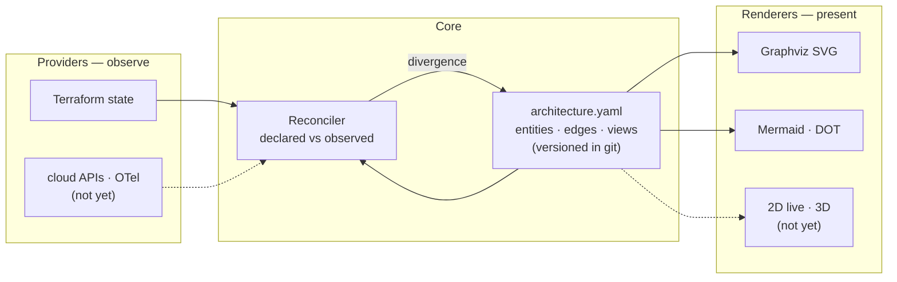
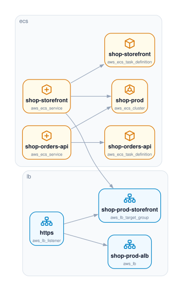
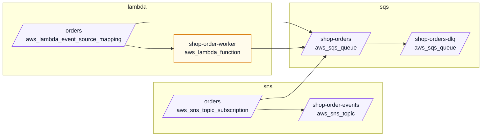

# driftwood

**Architecture as code, reconciled with live infrastructure.**

A versioned architecture *model* in git that is continuously checked against reality — Terraform state today, cloud APIs and telemetry later. When the model and the infrastructure diverge, that divergence becomes a pull request instead of a diagram nobody trusts.

> Status: **proof of concept.** The core loop works end to end. See [Where this is going](#where-this-is-going) for what is deliberately not built yet.

## Why

Two problems that are usually treated separately share one root cause:

- **Diagrams-as-code tools** (Structurizr, C4, `mingrammer/diagrams`, D2) move the picture into git but don't stop it rotting. A hand-maintained model decays exactly like a Visio file, just with better blame.
- **Live topology tools** (Dynatrace Smartscape, Datadog Service Map, Kiali) show real discovered topology but produce no artifact — nothing to version, nothing to review, no expression of design *intent*, and nothing a coding agent can edit.

Nobody owns the middle. driftwood is the middle.

### Graphviz: bundled, not required

`mingrammer/diagrams` requires the Graphviz **system binary**, which is often impossible to get approved inside a corporate environment. driftwood ships Graphviz instead of requiring it.

`@hpcc-js/wasm-graphviz` is real Graphviz compiled to WebAssembly — same DOT semantics, same layouts, zero transitive dependencies, WASM inlined into the JS. It is a **regular dependency**, so a plain `npm install` gives you working Graphviz on any machine, with no system package and no admin rights.

| Engine | Needs | Output |
|---|---|---|
| `graphviz` (native) | `dot` on PATH | SVG, icons and all. Preferred when present — faster on very large graphs, honours a site's own Graphviz build |
| `graphviz` (WASM) | **nothing — bundled** | SVG with category icons. The default |
| `dot` | nothing | DOT source (it's just text) |
| `mermaid` | nothing | Mermaid, renders natively in GitHub |

Out of the box:

```
$ driftwood engines
graphviz   available    bundled @hpcc-js/wasm-graphviz
mermaid    available    built-in
dot        available    built-in

auto would use: graphviz (bundled @hpcc-js/wasm-graphviz)
```

The one environment where Graphviz still can't run is a runtime with WebAssembly switched off — a hardened container, or `node --jitless`. There `auto` degrades to Mermaid rather than failing:

```
$ node --jitless dist/cli.js engines
graphviz   unavailable  WebAssembly is disabled in this runtime, so the bundled Graphviz cannot load - install the `dot` binary or use --engine mermaid
...
auto would use: mermaid (built-in)
```

Rare, but real — which is why the fallback isn't vestigial. Both paths are asserted in CI.

For size context, the bundled Graphviz is **smaller than `zod`**, which driftwood already depends on:

| Package | Size | Transitive deps |
|---|---|---|
| `zod` | 5.2 MB | — |
| `@hpcc-js/wasm-graphviz` | 2.1 MB (804 KB runtime) | none |
| `yaml` | 1.4 MB | — |

## How it fits together



The model is the only thing in git. Providers write into it, renderers read from it, the reconciler diffs it. Because everything routes through one model, "static diagram vs. live health" and "2D vs. 3D" are rendering modes rather than rewrites — health is just an attribute on a node, and blast radius is a traversal over edges that already exist.

## Install

```bash
npm install
npm run build
```

Running driftwood requires Node 20+. Runtime dependencies are `commander`, `yaml`, `zod`, and `@hpcc-js/wasm-graphviz` — all pure JavaScript/WebAssembly, no native builds and no system packages. (Developing driftwood asks for a newer Node than running it does — see [Development](#development).)

## Usage

### Import a model from Terraform state

```bash
npx tsx src/cli.ts import terraform examples/orders-platform.tfstate.json \
  --name orders-platform -o examples/architecture.yaml
```

Entity ids are Terraform addresses (`aws_s3_bucket.assets`). That's deliberate: the address is stable across plans, readable in a diff, and sidesteps the identity-resolution problem that kills CMDBs. Edges come from Terraform's own `dependencies`.

The worked example in `examples/` is a fictional e-commerce platform — CloudFront and Route 53 at the edge, an ALB in front of two ECS services, Postgres, Redis, DynamoDB and S3 behind them, and an SQS/SNS order pipeline with a Lambda worker. 45 resources: enough that the view mechanism is doing real work rather than decorating a diagram that fits on a page anyway.

### Validate

```bash
npx tsx src/cli.ts validate examples/architecture.yaml
```

Catches schema errors, duplicate ids, edges pointing at entities that don't exist, and views that match nothing. This is what makes agent edits safe to accept — a coding agent can rewrite the model and CI proves it's still coherent.

### Render

```bash
npx tsx src/cli.ts render examples/architecture.yaml --view app -o app.svg
```



Nodes are drawn with a category icon, the entity name, and its `kind` underneath. The icons are **drawn in this repo and chosen by category** — database, queue, load balancer — not by vendor: no icon pack to install, nothing to license, and one glyph that fits an RDS instance, a Cloud SQL instance and an on-prem Postgres alike. Colour groups the categories into families (edge, compute, data, messaging, security), so a diagram reads as a few zones instead of thirty unrelated boxes. Use `--no-icons` for plain boxes.

The icons are inlined into the SVG rather than handed to Graphviz as `image=` attributes, because the native `dot` binary resolves those as filesystem paths — a `data:` URI would work on the WASM tier and break on the native one. Post-processing the SVG means both tiers draw the same picture, and the result stays self-contained — no external references, no base64 bloat.

Every image in this README is generated from `examples/architecture.yaml` by `npm run docs`, and CI re-runs it and fails if the result differs from what is committed. A stale picture of your own output is worse than no picture, so the renders are checked against their source rather than trusted — the drift gate's own argument, one level up.

Runtime health can be overlaid without changing the committed model. Pass a JSON object whose keys are entity ids and whose values are `healthy`, `degraded`, or `down`:

```bash
npx tsx src/cli.ts render examples/architecture.yaml --view context \
  --health examples/health.json -o context-health.svg
```

The sample health map is [examples/health.json](examples/health.json). It names one entity per status, and the `context` view includes all three, so the render shows `healthy`, `degraded` and `down` together — a narrower view such as `app` filters some of them out. Health is render-time data only, so it is not included in reconciliation or written back to `architecture.yaml`.

Ids that match no entity in the model are reported on stderr rather than silently ignored, since a typo'd id would otherwise look identical to a healthy one.

The `async` view through Mermaid, which renders natively in a pull request:

<!-- generated:async -->

<!-- /generated:async -->

Mermaid has no icon primitive, so it maps the *same* categorisation onto shapes and colours — a queue must not be a queue in one engine and a cylinder in the other, or the two pictures stop describing the same system.

#### The rest of the views

| View | What it scopes to | File |
|---|---|---|
| `edge` | Route 53, CloudFront, ACM, WAF, the ALB | [svg](docs/edge.svg) |
| `app` | Load balancer through to the ECS services | [svg](docs/app.svg) |
| `data` | Postgres, Redis, DynamoDB, S3 | [svg](docs/data.svg) |
| `async` | The SQS/SNS/Lambda order pipeline | [svg](docs/async.svg) |
| `network` | VPC, subnets, security groups, NAT | [svg](docs/network.svg) |
| `context` | Everything, minus IAM and CloudWatch noise | [svg](docs/context.svg) |

**Views exist from v1, not as a later optimization.** Flat Mermaid becomes unreadable past roughly 150 nodes, and any real enterprise graph blows through that immediately. A view is a scoped slice matching entity ids or groups, with a trailing `*` wildcard. The example model ships six — `context`, `edge`, `app`, `data`, `async`, `network` — and even at 45 entities the difference between a view and the whole graph is the difference between a diagram and a wall.

### Reconcile — the point of the whole thing

```bash
npx tsx src/cli.ts reconcile examples/architecture.yaml \
  --terraform examples/orders-platform.drifted.tfstate.json
```

Two resources created by hand during an incident, one bucket deleted, one database renamed — and one secret the CI role simply cannot see:

```markdown
## Architecture drift detected

### Present in infrastructure, missing from the model (2)

- `aws_elasticache_replication_group.sessions_failover` - aws_elasticache_replication_group (shop-sessions-ha)
- `aws_sqs_queue.payments` - aws_sqs_queue (shop-payments)

### Declared in the model, not found in infrastructure (1)

- `aws_s3_bucket.uploads` - aws_s3_bucket (shop-example-com-uploads)

### Changed (1)

| Entity | Field | Declared | Observed |
|---|---|---|---|
| `aws_db_instance.orders` | name | shop-orders-prod | shop-orders-prod-v2 |

### Relationships

- **added** `aws_elasticache_replication_group.sessions_failover` -> `aws_security_group.data`
- **added** `aws_elasticache_replication_group.sessions_failover` -> `aws_subnet.private_a`
- **added** `aws_sqs_queue.payments` -> `aws_kms_key.data`
- **removed** `aws_iam_role_policy.order_worker` -> `aws_s3_bucket.uploads`
- **removed** `aws_lambda_function.order_worker` -> `aws_s3_bucket.uploads`
- **removed** `aws_s3_bucket.uploads` -> `aws_kms_key.data`

### Declared, but not verifiable (4)

_Inside a declared blind spot, so absence from the observation is unknown, not absent. Kept in the model rather than reported as removed._

| Entity | Blind spot | Why |
|---|---|---|
| `aws_secretsmanager_secret.db_password` | `aws_secretsmanager_*` | the read-only role used by CI can list secret names but not versions |

- `aws_db_instance.orders` -> `aws_secretsmanager_secret.db_password` - within `aws_secretsmanager_*`
- `aws_iam_role_policy.orders_api` -> `aws_secretsmanager_secret.db_password` - within `aws_secretsmanager_*`
- `aws_secretsmanager_secret.db_password` -> `aws_kms_key.data` - within `aws_secretsmanager_*`

_Ignored by policy: 1 entities, 0 edges._
```

The bucket was deleted and is reported as deleted. The secret was not — the role reading this state cannot list secrets, so it never came back — and that is the difference between the two sections. Collapsing them would mean proposing the deletion of a secret nobody deleted.

Exits **1** on drift and **0** when clean, so it works directly as a CI gate. Output is markdown because its destination is a pull request body.

## Extensible by design

Providers and renderers are both registries. A third-party plugin registers exactly the way a built-in does — there is no separate plugin API.

### Providers — where facts come from

| Provider | Kind | Platforms | Status |
|---|---|---|---|
| `terraform` | declarative | **any** (AWS, GCP, Azure, vSphere, on-prem) | built in |
| `dynatrace` | runtime | aws, gcp, azure, onprem, kubernetes | built in |
| Splunk, cloud APIs, OTel, Kubernetes | — | — | extension point ready |

Terraform is platform-agnostic on purpose: one provider covers every target, because the platform is whatever the state file declares.

The `declarative` / `runtime` split matters. Terraform says what *should* exist; Dynatrace says what is *actually running*. A service Terraform declares but Dynatrace has never seen is a very different finding from one neither knows about. When both describe the same entity, the declarative source wins on naming and grouping — IaC resource names beat monitoring display names.

Adding one is a small, well-defined job: see [`.claude/skills/add-provider/SKILL.md`](.claude/skills/add-provider/SKILL.md).

### Configuration

Wiring is declarative, so adding a provider or switching engines is a config edit rather than a code change:

```yaml
# driftwood.config.yaml
model: architecture.yaml

providers:
  - use: terraform
    with:
      statePath: ./terraform.tfstate
  - use: dynatrace
    with:
      url: https://abc12345.live.dynatrace.com
      tokenEnv: DYNATRACE_API_TOKEN   # the env var NAME, never the token

render:
  - view: context
    to: docs/context.mmd
    engine: auto
```

```bash
driftwood reconcile architecture.yaml -c driftwood.config.yaml
```

### Cross-source identity is explicit, never guessed

Terraform calls it `aws_lambda_function.forwarder`; Dynatrace calls it `SERVICE-A1B2`. Nothing in either payload proves they are the same thing, so driftwood **does not guess**:

```yaml
aliases:
  SERVICE-A1B2: aws_lambda_function.forwarder
```

Without an alias the two stay separate nodes. That is deliberate — a duplicated node is visible and fixable, whereas a wrongly merged node silently corrupts the graph. Where providers disagree about a merged entity, the disagreement is resolved *and reported*, never hidden.

## The drift policy

This is the design decision most likely to sink the project in practice. Report too much and every run becomes noise that gets muted; report too little and the model rots anyway.

**Default: structural facts count, metadata doesn't.**

| Change | Drift? |
|---|---|
| A resource appears or disappears | **Yes** |
| An edge appears or disappears | **Yes** |
| `kind`, `name`, or `group` changes | **Yes** |
| A tag is added or changed | No |
| Anything matching an `ignore` rule | No |
| A resource disappears inside a declared `coverage` gap | No — reported separately as not verifiable |

`ignore` holds intentional divergence, reviewed like code. An edge touching an ignored entity is ignored by implication — otherwise ignoring one noisy resource would still surface all of its edges.

## Coverage gaps are explicit

Read-only credentials never see everything, and **unknown must never be silently reported as absent**. The model declares its own blind spots:

```yaml
coverage:
  - scope: aws_secretsmanager_*
    reason: the read-only role used by CI cannot list secrets
```

A blind spot changes what a *disappearance* means. A declared entity that the providers never observed is reported under **Declared, but not verifiable** instead of as a removal, and it does not count towards the exit code — otherwise every run with read-only credentials fails, and a gate that always fails is a gate that gets muted. A scope matches an entity's id or its kind, and an edge inherits the blind spot of either endpoint, since a provider that cannot see a resource cannot see its relationships either.

The rule runs one way only. Coverage never suppresses an **addition**: a blind spot means "might not be seen", never "must not be reported", so a resource appearing inside one is newly visible and is reported normally. Nor does it affect a **change**, because an entity that was compared was, by definition, observed.

These are printed with every drift report. "Always matches live platform data" is a promise no tool can keep; reconciliation with declared blind spots is one it can.

## Project layout

```
src/
  registry.ts            shared name -> implementation registry
  model/schema.ts        the model — entities, edges, views, aliases, ignore, coverage
  model/validate.ts      schema + referential integrity
  model/merge.ts         multi-provider merge, provenance, conflict reporting
  providers/types.ts     the provider extension point
  providers/terraform.ts declarative — any platform Terraform manages
  providers/dynatrace.ts runtime — Smartscape topology, read-only
  render/types.ts        the renderer extension point (probe + render)
  render/select.ts       shared view scoping
  render/icons.ts        category icons, the kind -> icon/colour table, SVG injection
  render/mermaid.ts      always available
  render/dot.ts          DOT source, always available
  render/graphviz.ts     SVG via native dot or WASM, with tier detection
  reconcile/index.ts     declared vs observed -> drift report
  config.ts              driftwood.config.yaml
  cli.ts                 validate · render · engines · providers · import · reconcile
examples/                a worked 45-resource AWS platform, a drifted copy, and a config
scripts/render-docs.ts   regenerates docs/ and the README's embedded render
docs/                    committed renders of the example, kept current by CI
.claude/skills/          add-provider and add-renderer walkthroughs for agents
```

## Development

```bash
npm test        # 113 tests
npm run typecheck
npm run build
```

**Develop on Node 22.12+**, one major above the Node 20+ the tool itself runs on. Vitest 5 declares `engines: ^22.12.0 || ^24.0.0 || >=26.0.0`, and CI runs Node 22 on every job. npm only warns (`EBADENGINE`) rather than refusing the install, and the suite does still pass on Node 20 today — but that is unsupported and one Vitest release away from breaking, so match CI rather than rely on it.

The gap is deliberate and one-directional. driftwood ships as pure JavaScript with no build step for the consumer, so the floor for *using* it is set by the runtime deps and stays low; the floor for *developing* it is set by the dev toolchain and is free to move. A test runner that wants a newer Node must never raise the bar for someone installing the CLI.

## Where this is going

Built:

- [x] The model, with a schema and a real validator
- [x] Pluggable provider registry — Terraform (any platform) and Dynatrace built in
- [x] Pluggable renderer registry — Graphviz bundled and working out of the box, with Mermaid/DOT fallback
- [x] Category icons and a family palette, shared by every engine
- [x] Multi-provider merge with provenance, explicit aliases, and conflict reporting
- [x] Declarative `driftwood.config.yaml` wiring
- [x] Reconciler with an explicit drift policy, wired as a CI gate
- [x] Render-time health overlay for healthy, degraded, and down entities

Deliberately not built yet, roughly in order:

- [ ] Open the drift report as an actual pull request, not just a CI failure
- [ ] Live cloud API providers (AWS, GCP) to catch resources no IaC owns
- [ ] A Splunk provider (the extension point is ready; no implementation shipped yet)
- [ ] Preserve human/agent annotations across regeneration
- [ ] Interactive viewer, blast-radius traversal
- [ ] 3D — last, optional, and only if someone actually asks

**On 3D:** it's the reward, not the plan. Netflix's Vizceral was the flagship of exactly this concept and is effectively abandoned; Cloudcraft deliberately stopped at 2.5D isometric because it stays readable and screenshot-able. 3D topology demos brilliantly and then goes unused during incidents — it occludes, doesn't diff, doesn't paste into a postmortem, and needs a mouse. Build the model first and a 3D view stays cheap to add later.

## License

MIT
